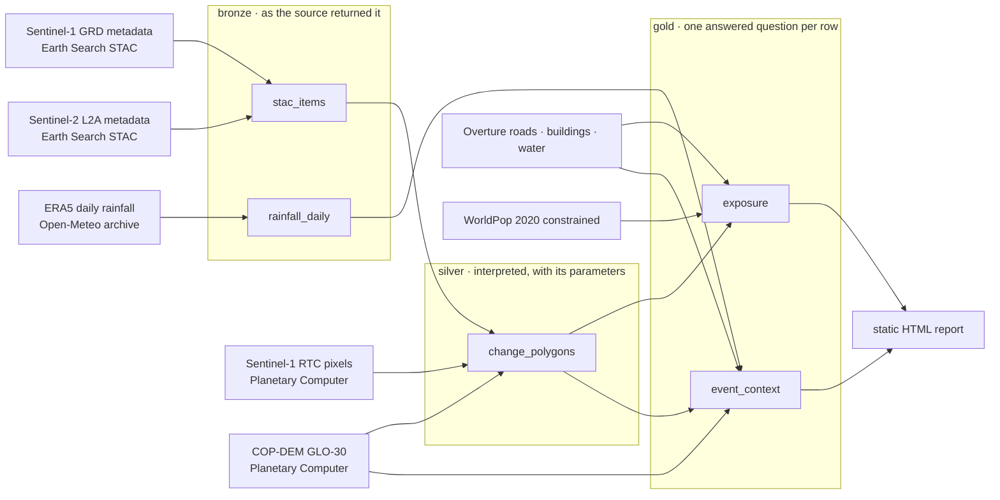
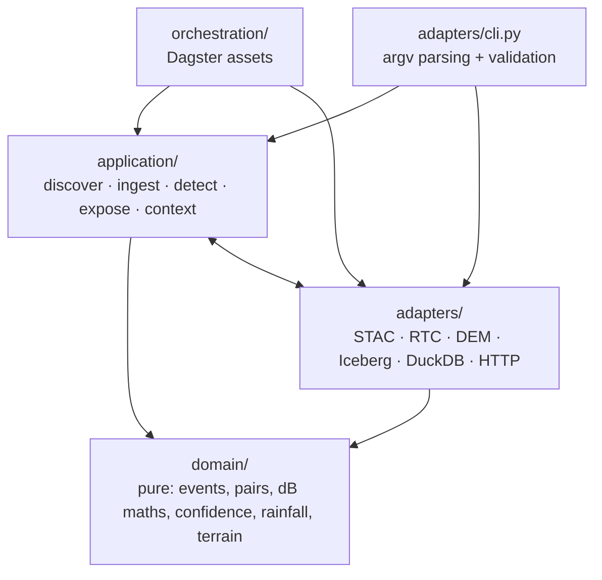
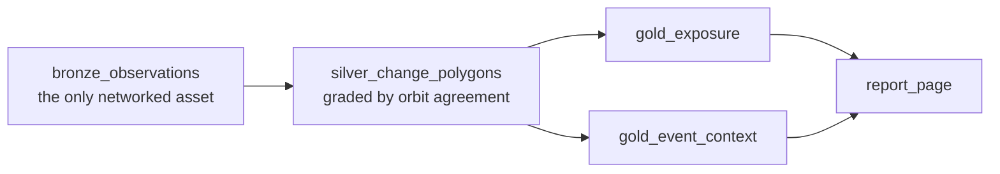

# Nepal Disaster Intelligence Platform

Reconstructs a disaster event from open Earth-observation data: what changed on the ground,
what stood inside the changed area, and what conditions preceded it. Sentinel-1 radar pairs
are compared across two look directions, the agreed-on regions become polygons in an Apache
Iceberg lakehouse, and terrain, rainfall, infrastructure and population are attached to each
one. It runs on free data and a laptop. The whole thing is one command, and the same code
writes to a local directory or to S3 depending on one environment variable.

V1 is scope-frozen to one case study, the 26 August 2026 Trishuli Valley event over a
0.6° × 0.8° corridor in Nuwakot/Rasuwa. See [`docs/contract-v1.md`](docs/contract-v1.md).

## Data flow

Bronze holds what each source returned. Imagery pixels are not copied into the lakehouse —
scene *metadata* is, and silver re-reads the pixels it needs from cloud-hosted COGs at the
resolution it works in. Reference layers (Overture, WorldPop, DEM) are cached on disk because
a release is immutable.



Sentinel-2 is discovered and landed in bronze but nothing downstream reads it: the best
post-event look is 54% cloud, so optical corroboration was dropped from V1
([ADR 0001](docs/decisions/0001-sar-primary-optical-corroborating.md)).

## Design decisions

| Decision | Instead of | Consequence |
|---|---|---|
| Every bronze/silver/gold write is an Iceberg `upsert` on a declared natural key | Append, then de-duplicate downstream | A retried or resumed run corrects rows in place. Re-ingest is not a data bug. |
| Silver row ids are a SHA-256 of event, parameters and geometry WKT | A running index over the result list | Two runs over different areas cannot collide and upsert over each other's polygons. |
| Only the first asset may touch the network; downstream assets read tables | Each stage re-querying its own sources | The declared dependency is the real one. `tests/unit/test_orchestration.py` inspects the asset source and fails if a later asset mentions `StacSearch` or `discover(`. |
| One warehouse code path: local `file://` and `s3://` differ by URI and credentials only | A separate cloud writer | MinIO over the S3 API is the local rehearsal of the cloud deploy, not a mock of it. |
| Confidence comes from agreement between ascending and descending passes | Trusting a lower dB threshold on one pass | Layover and shadow move with the look direction, real ground change does not. This is what does the narrowing, not the threshold. |
| `ScenePair` refuses a pre/post pair across relative orbits or orbit states, at construction | Pairing the two dates nearest the event | An invalid comparison cannot be built, so no downstream code has to remember the rule. |
| Radiometrically terrain-corrected imagery from the Planetary Computer | Requester-pays uncorrected GRD on AWS, or a local SNAP/hyp3 chain | In terrain like Nepal's, uncorrected backscatter makes every slope look like change. The AWS copy costs money to be worse. |
| Explicit timeouts and jittered backoff on every outbound call, GDAL included | Library defaults | GDAL ships with no read timeout; an unsigned `s3://` DEM read hung this pipeline with no error and no traffic. `adapters/raster/gdal_env.py` exists because of that. |

Two more that are cheap and paid for themselves: bronze keeps the untouched STAC feature as
`raw`, so adding a field later is a schema change rather than a re-download; and silver stores
the threshold, band, resolution and minimum mapping unit on every row, because a polygon found
at 3 dB is a different claim from one found at 2 dB.

## Code architecture



`domain/` is the layer with a hard rule and it holds: its only third-party imports are numpy
and scipy, and it imports nothing from the rest of the project. Change-detection arithmetic,
pair validity, the confidence grades and the antecedent rainfall index are all testable
without a network, a file or a GDAL install.

The two-way arrow is deliberate and is the honest part of this diagram. Use cases take their
collaborators by injection but type them against the concrete adapter classes, and the Iceberg
writers import the use case result objects they serialise. No ports are declared, because there
is one STAC implementation and one weather implementation; an interface gets added when a
second real implementation arrives, not in anticipation of one.

## Pipeline



Five Dagster assets, five Iceberg tables. The two gold assets are independent, so they can run
concurrently. `report_page` reads gold and only gold — anything it re-derived from silver would
be a second implementation of a rule that already has one, and there is a test for that too.

## What V1 found

Over the full area, three tracks, 30 m pixels, 3 dB threshold, 1 ha minimum: **732 graded
polygons, 16 corroborated by both look directions**. Exposure for those 16, on a 500 m buffer:
6,430 buildings, 411 road segments, a bridge within reach of 14 of them, and roughly 22,650
people — indicative only, since the population product sums about 20% above the national
estimate and that ratio is stored on every row.

The honest conclusion is in the contract and belongs here too: the pipeline finds *surface
change* and grades it well, and V1 cannot tell you the cause. Fifteen of the 16 sit on the
inhabited valley floor, where twelve days of monsoon river variation produce the same radar
darkening as a flood. The sixteenth is at 6,822 m on a 45° face and is most likely wet snow.
Neither group is confidently a landslide. Attribution is a V4 question.

Two checks were run against that result. The same pipeline over a window entirely *before* the
event returned **1 corroborated detection against 16**, with comparable raw per-track counts —
so the discrimination comes from the cross-geometry agreement rule, not from the threshold.
Re-running on VH instead of VV, an independent measurement of the same ground at the same
instants, matched 14 of the 16 regions against a chance baseline of 0.05.

## Run it

```bash
mise run install      # uv sync --all-extras
mise run test         # 128 unit tests, no network
mise run pipeline     # bronze through gold to the report, from an empty warehouse
mise run dagster      # the same graph in a UI on localhost:3000
```

`mise run pipeline` rebuilt all five tables from a deleted warehouse in **133 seconds** on
2026-09-07, reproducing the row counts the staged runs had produced. The integration test
`tests/integration/test_pipeline_cold.py` asserts the rebuild, not the timing.

Or one stage at a time — each writes its own layer and reads the one before:

```bash
uv run ndip discover    # usable scene pairs + rainfall context, writes nothing
uv run ndip ingest      # -> bronze.stac_items, bronze.rainfall_daily
uv run ndip detect      # -> silver.change_polygons
uv run ndip expose      # -> gold.exposure
uv run ndip context     # -> gold.event_context
```

The warehouse defaults to `data/warehouse` with a SQLite catalog. To run the identical code
against object storage:

```bash
mise run minio-up                      # MinIO on 127.0.0.1:9000, console on :9001
cp .env.local.example .env.local
set -a; source .env.local; set +a
uv run ndip ingest                     # same command, now writing to s3://
```

The same ingest produced the same **103 bronze rows** on both backends, with Hive-style
partition paths under `bronze/stac_items/data/event_id=.../collection=.../`. Only the
warehouse URI and the credentials differ.

Also available: `mise run test-all` (adds the network-hitting integration test),
`mise run lint`, `mise run typecheck` (mypy strict over `src/ndip`).

## Status

| | State |
|---|---|
| Scene pairing, rainfall context (`discover`) | built |
| Bronze ingest, idempotent (`ingest`) | built |
| Dual-geometry SAR change detection (`detect`) | built |
| Exposure — Overture + WorldPop (`expose`) | built |
| Event context — terrain, drainage, rainfall (`context`) | built |
| Dagster graph, one-command cold rebuild | built |
| Static HTML report generated from gold | built |
| S3-backed warehouse via MinIO, same code path | built |
| Nepal-scale lakehouse on Spark | planned (V2) |
| Historical disaster corpus | planned (V3) |
| ML susceptibility / impact | planned (V4) |
| GenAI analyst layer | planned (V5) |

**Not built, and not claimed:** no cloud deployment, no Terraform or other infrastructure-as-code
(`infra/` is an empty directory skeleton), no Kubernetes, no metrics export, no scheduler, no web
UI. V1 runs locally by design; cloud is a deployment target, not a dependency.

## Stack

Python 3.12 · Apache Iceberg via pyiceberg, SQLite catalog locally · Dagster · DuckDB with the
spatial extension for Overture · odc-stac, rasterio, rioxarray, shapely, pyproj, numpy, scipy ·
httpx with tenacity · structlog · pytest, ruff, mypy strict · mise + uv · MinIO via Docker
Compose for the S3 rehearsal.

---

Measured figures on this page come from single runs recorded in `docs/contract-v1.md` on
2026-09-07, against an upstream catalogue that keeps moving; they are measurements, not test
assertions. `CLAUDE.md` holds the working notes, including the failure modes that cost the most
time.
